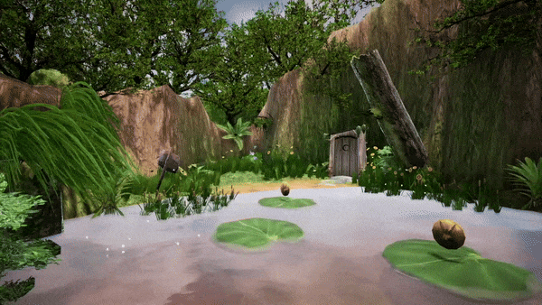

<h1 align="center">Remake of the culted Video Game - Shrek 2 on Unreal Engine 5</h1>

  

The main goal is move the original game to Unreal Engine 5.

:star: See more in  or :star:

<h2>Overview</h2>

Youtube preview of first two levels

3D models and Textures exported from original game using [UEViewer](https://github.com/gildor2/UEViewer).

Textures upscaled with [Upscayl](https://www.upscayl.org).

<h2>Used plugins</h2>

- [ClimbingSystem](https://github.com/Kaboms/UE-Climbing-System)
- [CombatSystem](https://github.com/Kaboms/UE-CombatSystem)
- [InventorySystem](https://github.com/Kaboms/UE-Inventory-System) (For potion shop and potion equipment)
- [GameInstanceServices](https://github.com/Kaboms/UE-ServicesSubsystem)
- [UI-Goodies](https://github.com/Kaboms/UE-UI-Goodies) (Radial Menu)

<h1>Progress</h2>

<h2>Levels</h2>

- ✅ 1. Swamp. Level implemented. Polishing.

- 🔄 2. Carriage Hijack. Level implemeted. In progress.

- ❌ 3. The Hunt. TODO

- ❌ 4. Fairy Grand Mother's Office (Puss in Boots). TODO

- ❌ 5. Fairy Grand Mother's Office (Donkey). TODO

- ❌ 6. Hamlet. TODO

- ❌ 7. Prison (Donkey). TODO

- ❌ 8. Prison (Puss in Boots). TODO

- ❌ 9. Prison (Shrek). TODO

- ❌ 10. Castle Siege. TODO

- ❌ 11. Fairy Grand Mother Battle. TODO

<h2>Game Features</h2>

- ✅ Platforming, climbing.

- ✅ Combat system.

- ✅ Shop.

- 🔄 UI. Most work done, but need polishing.

- 🔄 Potions. System implemented. By now worked only one potion. In Progress

- 🔄 Save/load system. Basic implementation. In progress.

- 🔄 Gamepad integration. UI and Player Controller integrated. Polishing

- ❌ Cutscenes.

<h2>Player Characters</h2>

- ✅ Shrek. Implemented. Polishing.

- 🔄 Donkey. In progress

- ❌ Puss in Boots. TODO
